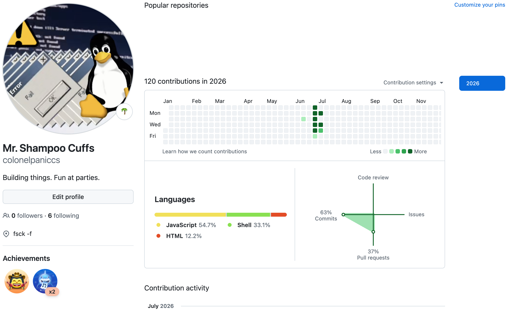

# GTM Engine

> Automated prospect intelligence pipeline for MENA/GCC go-to-market expansion.

[]()
[]()
[]()

> [!IMPORTANT]
> This repository is documentation and architecture only. It is not a runnable clone of the production system. No implementation code, prompt library, scoring logic, or signal sources are included, by design. See `docs/security.md` and `docs/design-principles.md` for why.

---

## What It Does

Daleel's GTM Engine continuously monitors publicly available signals across the MENA/GCC region, identifies companies exhibiting scaling behavior, scores them against a defined ICP, and surfaces prioritized accounts to a revenue team. No manual research required.

Built agentic from the start: the Engine reasons, infers, routes, and acts on the team's behalf. A monitoring layer schedules health checks across the pipeline and escalates genuine anomalies, not routine variance.

Signal in. Scored. Enriched. Routed. Every run.



*Ongoing build activity from the private repository this public repo documents.*

## Design Principles

See [`docs/design-principles.md`](./docs/design-principles.md) for the full list. This is the philosophy that survives any tooling change.

## Architecture Overview


Six capability stages. Every handoff between them is validated before the next begins. See [`architecture/data-flow.md`](./architecture/data-flow.md).

## How It Works

> [!NOTE]
> **Signals in.** Public signals are detected and normalized into a structured stub: company, region, a plain-language summary of what happened, and enough additional context to judge relevance before anything downstream runs. Signals can also be submitted directly by team members or users for the same evaluation.

> [!NOTE]
> **Dedup and recency.** Every signal is checked against what's already known before anything downstream runs. A company scored recently, with no meaningful new signal, gets a lightweight update instead of a full re-run.

> [!IMPORTANT]
> **Reasoning.** Structured context is matched against a defined scoring framework, sales maturity is inferred with a confidence label attached, and a composite score determines the action tier. Nothing here is treated as final until it clears validation.

> [!IMPORTANT]
> **Validation, persistence, and notification.** Output is checked against a strict schema before anything is written. Validated results sync to the system of record, and a full audit is written for every outcome, including when nothing changed. Under normal conditions, prioritized accounts reach the revenue team through a scheduled digest, not a live feed. A sudden signal concentration at the account level bypasses that cadence and routes straight to the responsible rep.

## AI Components

See [`docs/ai-components.md`](./docs/ai-components.md): capability-first, tools are swappable.

## Example Workflow


*Illustrative example, fictional company, no real data. See `/examples` for the sanitized input/output pair and the webhook payload contract each result has to satisfy before it's accepted.*

## Roadmap

See [`docs/roadmap.md`](./docs/roadmap.md) for what's near-term versus supported as needed, and why that distinction matters.

## License

All rights reserved, except `/examples` (sanitized fictional sample data and the webhook schema), which is MIT licensed. See [`LICENSE`](./LICENSE) for the full terms.

## Contributing

See [`CONTRIBUTING.md`](./CONTRIBUTING.md): this is a solo-maintained, documentation-only repository. Issues are welcome for questions about architecture or design reasoning; pull requests are not accepted.

## Security

See [`docs/security.md`](./docs/security.md) for the credential-handling and data-minimization principles this system is built on.

---

### Repository Structure

```
README.md         this file
CONTRIBUTING.md    repo purpose, issue policy, why pull requests aren't accepted
CHANGELOG.md       version history for this repository
LICENSE            all rights reserved, except /examples (MIT)

/docs             philosophy, design principles, governance, security, roadmap, AI components
/architecture     system overview, data flow, component map (capability-level)
/examples         sanitized sample input/output, webhook schema
/images           pipeline flow, example workflow, and build-activity diagrams
```
