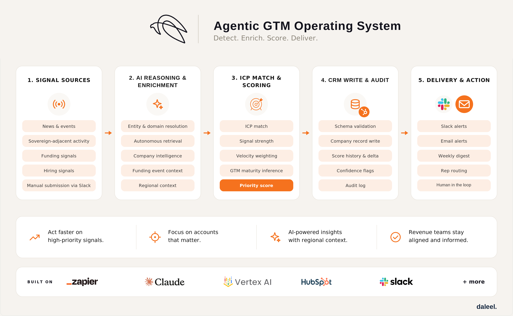
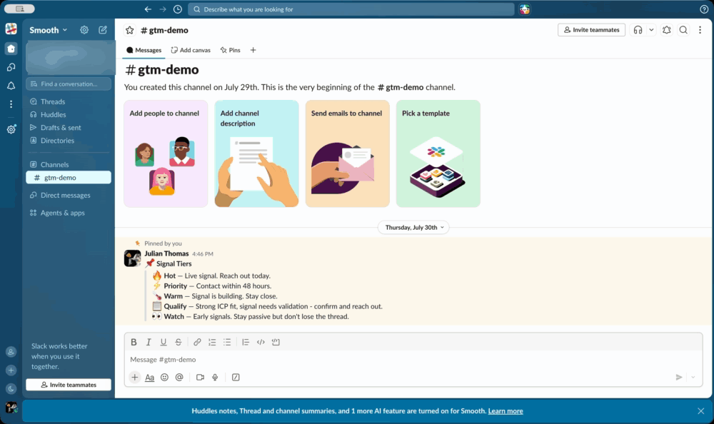
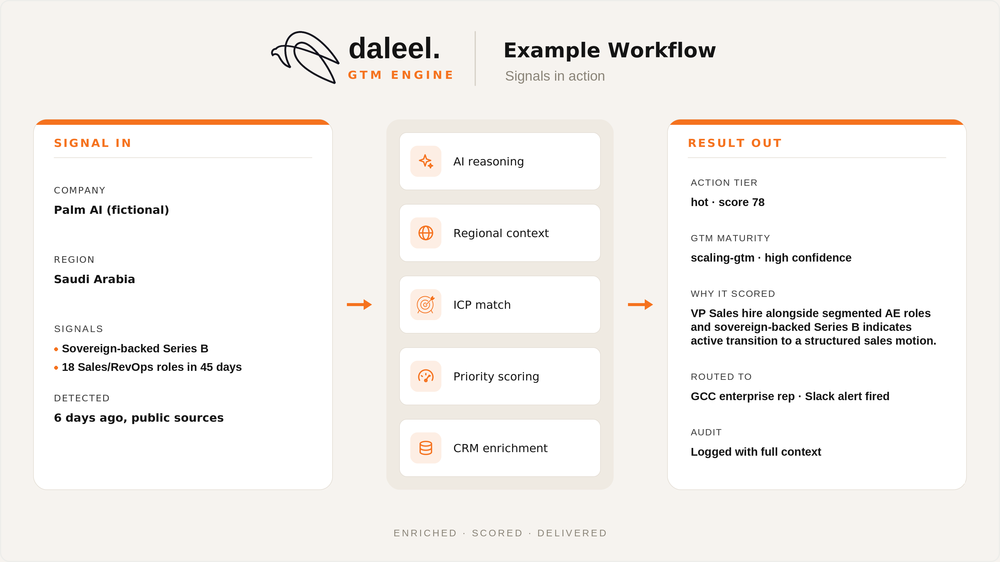

<h1>
  
  Daleel | GTM Engine
</h1>
<br clear="all" />

> The signal intelligence layer inside your revenue stack — built for teams scaling go-to-market in the Middle East

[]()
[]()
[]()

> [!IMPORTANT]
> This repository is documentation and architecture only. Implementation code, the prompt library, scoring logic, and signal sources stay private. See `docs/security.md` and `docs/design-principles.md`.

---

## What It Does

Daleel's GTM Engine continuously monitors publicly available signals across the MENA/GCC region, identifies companies exhibiting scaling behavior, scores them against a defined ICP, and surfaces prioritized accounts to your revenue team. No manual research required. Multilingual by design, with Arabic inputs handled natively.

A signal is a cue to look closer, not something to repeat back. A good seller knows it should never be the copy. More on this in [`docs/philosophy.md`](./docs/philosophy.md).

Built agentic: the Engine reasons, infers, routes, and acts on the team's behalf, writing records and routing alerts. A named agent schedules health checks across the pipeline and surfaces what needs attention.

Teams selling into revenue and sales orgs use Daleel's engine signals to see who's actively scaling, and how ready they are to buy.

Current platforms are built for markets that already have deep, structured coverage. The Gulf's AI and software economy is one of the fastest-growing in the world, but stands uncovered. We are building for that gap.

Signal in. Enriched. Scored. Routed. Every run.

## Design Principles

See [`docs/design-principles.md`](./docs/design-principles.md) for the full list, and [`docs/philosophy.md`](./docs/philosophy.md) for the thinking behind them.

## Architecture Overview



Five capability stages. Every handoff between them is validated before the next begins. See [`architecture/data-flow.md`](./architecture/data-flow.md).

## How It Works

> [!NOTE]
> **Signals in.** Public signals are detected and normalized into a structured stub: company, region, a plain-language summary of what happened, and additional context to judge relevance before anything downstream runs. Signals can also be submitted directly by team members or users for the same evaluation.

> [!NOTE]
> **Dedup and recency.** Every signal is checked against what's already known. A company scored recently, with no meaningful new signal, gets a lightweight update.

> [!IMPORTANT]
> **Reasoning.** Structured context is matched against a defined scoring framework, sales maturity is inferred with a confidence label attached, and a composite score determines the action tier.

> [!IMPORTANT]
> **Validation, persistence, and notification.** Output is checked against a strict schema before anything is written. Validated results sync to your CRM, and a full audit is logged for every outcome, including when nothing changed. Prioritized accounts reach the revenue team through a scheduled digest. A sudden spike in signal concentration at the account level routes straight to the responsible rep.

## Walkthroughs



*A company submitted in chat, enriched and scored in the same thread. Fictional company, no real data.*


*The weekly email digest as it arrives. Fictional companies, no real data.*

## AI Components

See [`docs/ai-components.md`](./docs/ai-components.md): capability-first, tools are swappable.

## Example Workflow



*Illustrative example, fictional company, no real data. See [`/examples`](./examples) for the fictional input/output pair and the webhook payload contract.*

## Roadmap

See [`docs/roadmap.md`](./docs/roadmap.md) for what's near-term versus developed as needed.

## License

All rights reserved, except `/examples` (fictional sample data and the webhook schema), which is MIT licensed. See [`LICENSE`](./LICENSE) for the full terms.

## Contributing

See [`CONTRIBUTING.md`](./CONTRIBUTING.md): this is a solo-maintained, documentation-only repository. Issues are welcome for questions about architecture or design reasoning; pull requests are not accepted.

## Security

See [`docs/security.md`](./docs/security.md) for credential-handling and the data-minimization principles this system is built on.

---

### Repository Structure

```
README.md         this file
CONTRIBUTING.md    repo purpose and issue policy
CHANGELOG.md       version history for this repository
LICENSE            all rights reserved, except /examples (MIT)

/docs             philosophy, design principles, governance, security, roadmap, AI components
/architecture     system overview, data flow, component map (capability-level)
/examples         fictional sample input/output, webhook schema
/images           pipeline flow, example workflow, walkthrough recordings,
                  and build-activity diagram
```
